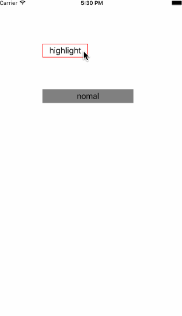

# ButtonExtension
UIButton 的 category，使 UIButton 的borderColor，backgroundColor 可以方便的根据 state 进行改变

# 怎样使用
将 Classes 里面的文件拖进项目，根据提供的接口进行设置即可。

# Demo 效果

	

Demo效果

# 许可
UIButtonExtension is available under the MIT license. See the LICENSE file for more info.

